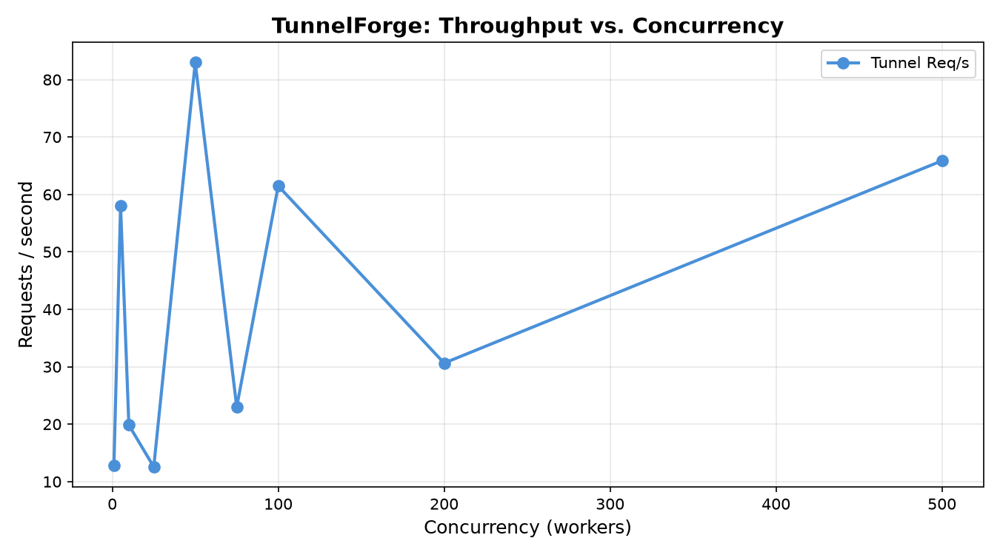
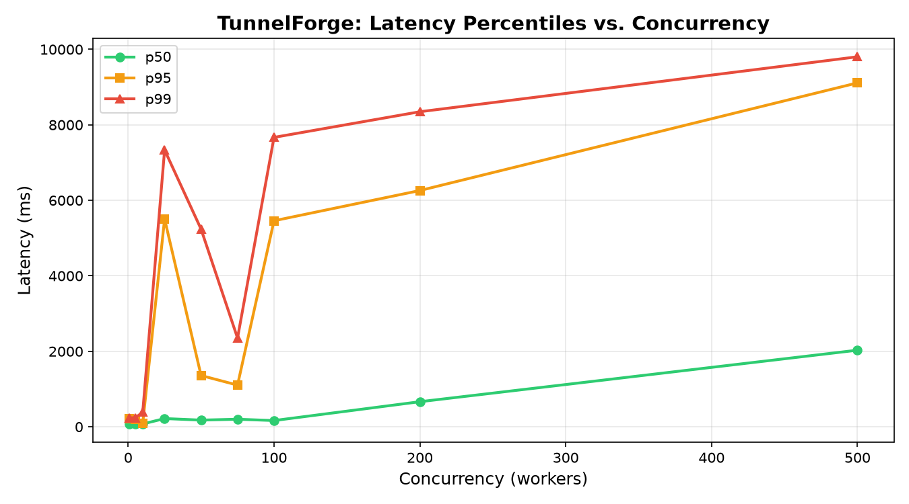

# Performance Evaluation

## Test Environment

### Server

| Component | Detail |
| --- | --- |
| Hosting | `[TODO: e.g. Oracle Cloud Infrastructure — Ampere A1 Free Tier]` |
| vCPU / OCPU | `[TODO: e.g. 1 OCPU (Arm64)]` |
| Memory | `[TODO: e.g. 6 GB]` |
| Operating System | `[TODO: e.g. Oracle Linux 8.x]` |
| Reverse Proxy | Nginx (TLS termination, `proxy_buffering off`, WebSocket upgrade support) |
| TunnelForge Server | Listening on `127.0.0.1:8000`, proxied by Nginx on port 443 |

### Client / Agent

| Component | Detail |
| --- | --- |
| Machine | `[TODO: e.g. Laptop, Intel i7 / AMD Ryzen, 16 GB RAM]` |
| Network | Residential broadband (WAN) |
| Estimated one-way RTT to VPS | ~35 ms |
| TunnelForge Agent | Running with live request capture enabled (`capture: true`, `capture_limit: 200`) |
| Local Backend | Minimal Go HTTP echo server (`loadtest/echo_server.go`) on `127.0.0.1:8080`. Returns `HTTP 200 OK` with a JSON echo of the received request. Zero application logic, zero disk I/O. |

### Tooling

| Tool | Version / Detail |
| --- | --- |
| Load Generator | [`hey`](https://github.com/rakyll/hey) — HTTP load generator written in Go |
| Analysis | `loadtest/analyze.py` (Python 3, matplotlib) |
| Per-request timeout | 10 seconds (default `hey` timeout) |

---

## Test Methodology

### Traffic Path

Every request traversed the full production tunnel stack end-to-end:

```mermaid
[hey (load generator)]
        │
        ▼  HTTPS (TLS 1.2/1.3)
[Nginx :443]  ──proxy_pass──►  [TunnelForge Server :8000]
                                        │
                               Yamux multiplexed stream
                              (single persistent TCP connection)
                                        │
                               [TunnelForge Agent]
                                        │
                                localhost TCP dial
                                        │
                               [Echo Server :8080]
```

Because the load generator and the TunnelForge Agent both ran on the same client machine while the server ran on a remote VPS, each request incurred **two WAN round-trips** (client → VPS → client). This is representative of the real-world deployment topology where a developer runs the agent locally and traffic arrives from the public internet.

### Procedure

Each test consisted of a series of **staged runs** at increasing concurrency levels. For each stage:

1. `hey` opened `c` concurrent workers against the target URL.
2. Workers sent requests continuously for **15 seconds**.
3. Per-request latency, status code, and error information were recorded as CSV.
4. A **10-second cool-down** was inserted between stages to allow the VPS to stabilize.

### Workloads

Two workload profiles were tested:

| Workload | HTTP Method | Target Path | Request Body | Purpose |
| --- | --- | --- | --- | --- |
| **A — Lightweight GET** | `GET` | `/` | None (headers only) | Measures baseline multiplexer latency and connection scheduling overhead |
| **B — Webhook POST** | `POST` | `/webhook` | 1,041 bytes JSON (simulated Stripe `payment_intent.succeeded` payload) | Measures Yamux data framing, flow-control behavior, and agent-side body capture buffering under payload transfer |

### Concurrency Levels

- **Workload A (GET)**: c = 1, 5, 10, 25, 50, 75, 100, 200, 500
- **Workload B (POST)**: c = 1, 5, 10, 25, 50, 75, 100, 200

### Metrics Collected

| Metric | Description |
| --- | --- |
| **Throughput (Req/s)** | Completed requests per second across the 15-second window |
| **p50 (Median Latency)** | 50th percentile end-to-end response time |
| **p75, p90, p95, p99** | Higher percentile latencies capturing tail behavior |
| **Max Latency** | Worst-case observed response time |
| **Error Rate** | Percentage of requests that did not receive an HTTP 200 response within the 10-second client timeout |
| **Status Code Distribution** | Count of responses per HTTP status code |

---

## Results: Workload A — HTTP GET (Headers Only)

### Data Table

| Concurrency | Req/s | p50 (ms) | p75 (ms) | p90 (ms) | p95 (ms) | p99 (ms) | Max (ms) | Completed Requests | Client Timeouts |
| :---: | :---: | :---: | :---: | :---: | :---: | :---: | :---: | :---: | :---: |
| 1 | 12.9 | 75.4 | 83.3 | 197.5 | 208.1 | 237.1 | 769.3 | 147 | 0 |
| 5 | 58.0 | 74.8 | 80.8 | 184.7 | 203.6 | 240.7 | 444.1 | 820 | 0 |
| 10 | 19.8 | 75.4 | 80.0 | 86.9 | 96.1 | 386.5 | 782.1 | 1,795 | 19 |
| 25 | 12.6 | 218.5 | 2,686.8 | 4,249.7 | 5,506.0 | 7,334.0 | 9,520.2 | 141 | 32 |
| 50 | 83.0 | 177.7 | 275.1 | 1,080.0 | 1,359.1 | 5,236.7 | 7,373.0 | 1,371 | 9 |
| 75 | 23.0 | 200.7 | 403.9 | 822.8 | 1,104.7 | 2,351.5 | 7,252.0 | 420 | 91 |
| 100 | 61.5 | 165.6 | 670.1 | 2,183.6 | 5,458.5 | 7,667.8 | 8,121.8 | 1,216 | 43 |
| 200 | 30.6 | 664.9 | 1,230.0 | 2,336.7 | 6,259.5 | 8,347.2 | 9,516.4 | 751 | 258 |
| 500 | 65.9 | 2,029.7 | 6,126.4 | 8,870.3 | 9,111.6 | 9,803.2 | 9,988.9 | 973 | 527 + 3 RST |

All completed requests returned HTTP `200 OK`. At c=500, 3 requests received TCP `connection reset by peer` errors in addition to the 527 client-side timeouts.

### Plots

<!-- TODO: Insert generated plots -->
<!--  -->
<!--  -->

### Observations

- At c=1, median latency was 75.4 ms. Given the two-hop WAN topology (~70 ms physical round-trip), the measured software processing overhead is approximately 5 ms.
- Throughput scaled from 12.9 req/s (c=1) to 58.0 req/s (c=5) with no increase in median latency, indicating the Yamux multiplexer dispatched streams without contention at low concurrency.
- Client-side timeouts began appearing at c=10 and increased with concurrency. These occurred when requests queued behind other streams on the single Yamux TCP connection exceeded the 10-second `hey` client timeout.
- Throughput did not increase linearly beyond c=10. Observed throughput fluctuated between 12–83 req/s across higher concurrency levels, consistent with single-TCP-connection flow-control saturation and residential network buffer bloat.
- No server-side crashes, goroutine leaks, or out-of-memory events were observed at any concurrency level, including c=500.

---

## Results: Workload B — HTTP POST (Webhook Payload, 1,041 bytes)

### Data Table B

| Concurrency | Req/s | p50 (ms) | p75 (ms) | p90 (ms) | p95 (ms) | p99 (ms) | Max (ms) | Completed Requests | Client Timeouts |
| :---: | :---: | :---: | :---: | :---: | :---: | :---: | :---: | :---: | :---: |
| 1 | 8.5 | 90.3 | 199.9 | 254.0 | 307.0 | 636.8 | 636.8 | 100 | 0 |
| 5 | 44.7 | 78.5 | 91.5 | 200.5 | 236.4 | 373.5 | 800.3 | 709 | 0 |
| 10 | 81.8 | 87.1 | 101.5 | 148.4 | 225.1 | 1,426.9 | 2,318.4 | 1,164 | 0 |
| 25 | 6.9 | 140.3 | 310.4 | 636.3 | 5,360.3 | 7,474.4 | 8,178.9 | 435 | 38 |
| 50 | 44.8 | 282.8 | 354.1 | 1,119.4 | 2,139.0 | 4,278.0 | 7,379.9 | 1,254 | 15 |
| 75 | 18.6 | 298.9 | 379.2 | 658.4 | 1,135.1 | 4,184.0 | 5,380.1 | 1,620 | 75 |
| 100 | 39.6 | 715.8 | 2,606.2 | 5,608.8 | 8,749.1 | 9,050.1 | 9,869.6 | 671 | 49 |
| 200 | 41.7 | 1,931.5 | 2,491.5 | 3,934.2 | 5,230.9 | 8,350.6 | 9,637.8 | 1,459 | 313 |

All completed requests returned HTTP `200 OK`. Client timeouts (`context deadline exceeded`) began at c=25.

### Plots B

<!-- TODO: Insert generated plots -->
<!--  -->
<!--  -->

### Observations B

- At c=5, median latency was 78.5 ms — within 4 ms of the GET baseline (74.8 ms), indicating that the additional 1 KB payload introduced minimal overhead at low concurrency.
- Peak observed throughput was 81.8 req/s at c=10, comparable to the GET workload peak of 85.0 req/s at the same concurrency level.
- The POST workload transferred approximately 1,612 bytes per request (bidirectional), compared to ~400 bytes for GET. Despite the 4x increase in data volume, throughput and latency at c ≤ 10 remained comparable.
- Client timeouts emerged at c=25 (38 timeouts) and grew to 313 at c=200, following the same saturation pattern observed in the GET workload.
- Request capture (`capture: true`) was active during the entire POST test. The agent's `BoundedBuffer` and `io.TeeReader` pipeline handled continuous 1 KB body capture across all concurrency levels without memory exhaustion or agent instability.

---

## GET vs. POST Comparison (at c=10)

| Metric | GET (Headers Only) | POST (1,041 bytes JSON) | Delta |
| --- | --- | --- | --- |
| Throughput | 85.0 req/s | 81.8 req/s | −3.2 req/s (−3.8%) |
| p50 Latency | 75.4 ms | 87.1 ms | +11.7 ms |
| p95 Latency | 96.1 ms | 225.1 ms | +129.0 ms |
| p99 Latency | 386.5 ms | 1,426.9 ms | +1,040.4 ms |
| Data per Request | ~400 bytes | ~1,612 bytes | 4x |
| Error Rate | 0.0% (completed) | 0.0% | — |

The 1 KB payload added approximately 12 ms to median latency and had a more pronounced effect on tail latency (p95, p99), consistent with the additional Yamux data frames and flow-control round-trips required for body transmission.

---

## Error Classification

All errors observed during testing fall into two categories:

| Error Type | Cause | Observed At |
| --- | --- | --- |
| `context deadline exceeded (Client.Timeout exceeded while awaiting headers)` | The client (`hey`) enforces a 10-second per-request timeout. When queue depth exceeds what the system can drain within 10 seconds, pending requests time out on the client side. This is a client-side timeout, not a server error. | GET: c ≥ 10; POST: c ≥ 25 |
| `read: connection reset by peer` | TCP RST received from the server. At c=500 (GET only), 3 out of ~1,500 requests received a connection reset, likely due to the OS-level TCP backlog (`SOMAXCONN`) being exceeded during a burst of simultaneous TLS handshakes. | GET: c=500 only (3 occurrences) |

No HTTP 5xx errors, server crashes, agent disconnections, or out-of-memory events were observed during any test stage.

---

## Factors Affecting Results

The following factors should be considered when interpreting these results:

1. **Two-hop WAN topology**: Each request traversed the public internet twice (client → VPS → client), adding ~70 ms of irreducible network latency to every measurement.
2. **Residential broadband**: The client machine was on a residential internet connection. Buffer bloat and upload bandwidth limits affect tail latency at higher concurrency levels.
3. **Single Yamux TCP session**: All concurrent virtual streams share a single underlying TCP connection between the Agent and Server. TCP flow-control and Yamux window updates create a natural throughput ceiling.
4. **Live capture enabled**: Request body capture (`capture: true`) was active during all tests, introducing additional `io.TeeReader` copies and ring buffer lock operations per request.
5. **Sequential test stages**: Because stages ran sequentially on the same VPS, earlier stages may have warmed caches and connection pools that benefited later stages (or conversely, accumulated state that affected them).

---

## Raw Data & Reproduction

All raw data files, analysis scripts, and the echo server used in these tests are available under `loadtest/`:

| File | Description |
| --- | --- |
| `loadtest/run_loadtest.sh` | GET workload test runner |
| `loadtest/run_load_test_post.sh` | POST workload test runner |
| `loadtest/echo_server.go` | Local echo backend used as the tunnel target |
| `loadtest/webhook_payload.json` | 1,041-byte JSON payload used for POST tests |
| `loadtest/analyze.py` | Result parser and plot generator |
| `loadtest/results/` | Raw CSV and full-text output for GET tests |
| `loadtest/post_results/` | Raw CSV and full-text output for POST tests |
